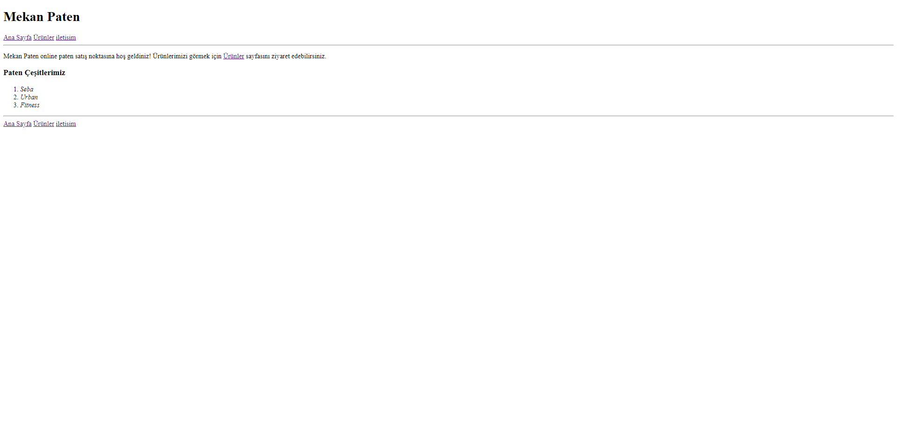
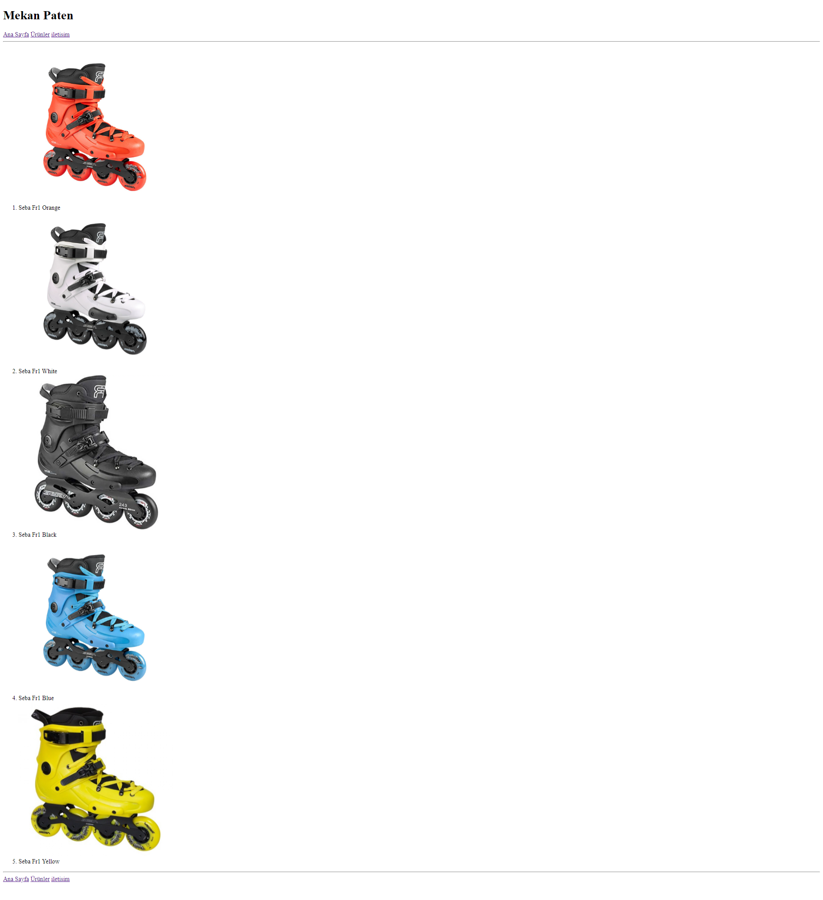
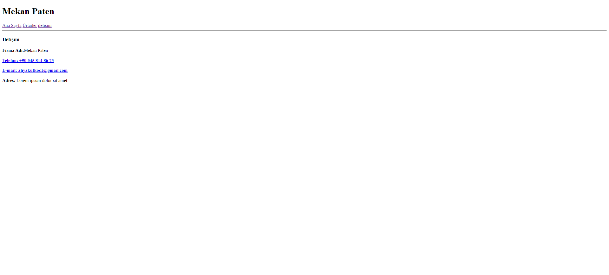

# patikahomework3

Bu repo [Patika.Dev](https://www.patika.dev) Front-End Eğitiminde ödev olarak yapmış olduğum patikahomework3 uygulaması.





## Installation
Öncelikle projeyi clonelayın.[patikahomework3](https://github.com/NoppePay/patikahomework3.git)

```bash
git clone https://github.com/NoppePay/patikahomework3.git
```

## Usage

Projeyi cloneladıktan sonra Visual Studio Code programında açınız.

Linux için:

```linux
cd patikahomework3
code .
```

## Contributing

Pull requestler kabul edilir.

## License

[MIT](https://choosealicense.com/licenses/mit/)
